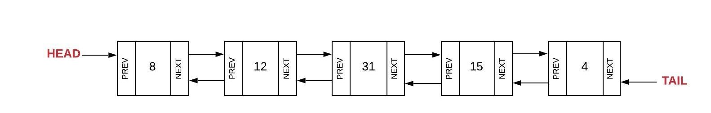

# Linked List Data Structure

**What is Linked List and how does it work?**

Linked List is linear data (chain) structure where nodes are connected in a squence. Each node contains 2 components:
1. Data - value of information
2. Reference - link to the next node.

The benefits of using linked list structure is the effcient ease to delete and insert with a few references VS shifting with multiple elements like an array.

Below is an image that displays a single-linked list. The head is the first node which is A with a blank box for next. Then B with a blank box for next and so on.

Below is an image of a double-linked list that has a tail to go back to the previous node. 

**What does this look like in Python?**

First lets talk about inserting into a linked list. Arrays when you insert it is normally towards the end of the array. Linked Lists it is only effecting the nodes around the element, which allow the capacity to be more dynamic. Often in code you will see new nd current being used. This can get confusing but current is refered to what exists in the list and new is add new data.

**Important code to know and understand to utilize this structure as follows:**

***Insert at the head***

It is exactly how it sounds. Insert the element at the start/head of the element list.

`self.head = new_node`

***Insert previous node***

Same here with where we want to place the new_node in the middle or in a certain spot in the linked list, for example, use the index and then "prev" or "next". If you wish to place at the tail replace .head with .tail

`new_node.prev = self.head` or `new_node.next = new_node`

***Insert at the tail***

It is exactly how it sounds. Insert the element at the end/tail of the element list.

`new_node.next = self.tail`

There is more indepth information to learn about this structure. There are ways to update, search through a list using specific data values (kind of like a query), if you want to see each node you use a traverse method and etc. Click the link below to learn more indepth methods. 

[GeeksForGeeks- Python Linke List](https://www.geeksforgeeks.org/python-linked-list/)

**Ready for Examples?**

Ok lets got back over briefly what you have learned:
1. Linked list is chain of squence with 2 parts to the node. 1. Data and 2. Refernce.
2. It is flexible with placement of nodes anywhere in the list.
3. There are 4 parts of the Python code to implement:
    - head - to add a node at the start.
    - next - to place next after another node.
    - prev - to place before another node.
    - tail - to add a node at the end.

Ok now that is covered, lets look at a scenario example of using linked list. Click the link below to see the example.

[Linked List Example](linked_exp.py)

***Challenge***

Now it is time to see if you can practice what you have learned. Do not be afraid to play around with your code to experiement. I will provide some ideas to take it a step further.

[Star Wars Challenge](starwars.py)

[Solution](starwars_solution.py)

