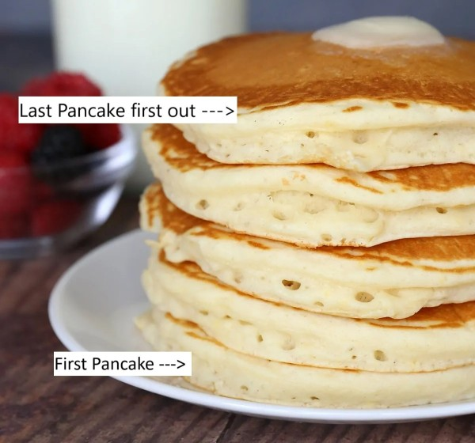

# Stack Data Structure

**What is Stack and how does it work?**

Stack is a data structure that following an order of performing operations known as LIFO (last in first out) or FILO (first in last out). 

A way to visualized this is imagine stacking pancakes on a plate. The last pancake placed on top of the stack will be the first to be eaten before getting to the first pancake on the plate. Below is an image with labels to display the concept.

**Ok, I am hungry now! How does this apply to Python?**

As becoming a programmer/developer this is used often in forms of lists which are used to fetch data or to search or for whatever purpose a list has in the program structure. 

**Important code to know and understand to utilize this structure as follows:**

***Append / Push***

Append or Push is what adds new values onto the stack. Let’s say that you ordered 6 pancakes but got 4. Use "append / push" the 2 pancakes onto your existing stack.

`stack.append(value)`

***Pop***

Pop is oddly the opposite of what you would think. It is used to remove values from the stack starting at the top. Let’s say you ordered 4 pancakes and got 6 pancakes. Use "pop" on the 2 pancakes to remove from the existing stack.

`stack.pop()`

***Len***

Len is returning the size of the stack. In the Big-O-notation, (reference link: [Big-O-notations](https://stackabuse.com/big-o-notation-and-algorithm-analysis-with-python-examples/)), this would be a O(1) times, because every time an update is done to the stack, the size will also update. There would be no need to count every time.

`length = len(stack)`

**Ready for Examples?**

Ok lets got back over briefly what you have learned:
1. Stacks are like pancakes and will use either LIFO or FILO.
2. Commonly used in a form of a list.
3. There are 3 common Python codes to implement:
    - append - to add to the stack
    - pop - to remove from the stack
    - len - returns the length/size of the stack

Ok now that is covered, lets look at a scenario example of using stack. Click the link below to see the example.

[Pancake Stack Example](pancake.py)

***Challenge***

Now it is time to see if you can practice what you have learned. Do not be afraid to play around with your code to experiment. I will provide some ideas to take it a step further.

[Ice Cream Challenge](icecream.py)

[Solution](solution_icecream.py)

